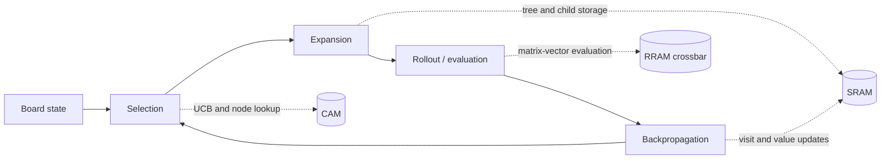

<h1 align="center">IMC-MCTS</h1>

<p align="center">
  <strong>In-memory-compute acceleration for Monte Carlo Tree Search</strong>
</p>

<p align="center">
  <a href="#architecture">Architecture</a> ·
  <a href="#quick-start">Quick Start</a> ·
  <a href="#paper-evaluated-applications">Applications</a> ·
  <a href="#citation">Citation</a>
</p>

<p align="center">
  
  <a href="CITATION.cff">
    
  </a>
  <a href="https://arxiv.org/abs/2607.22869">
    
  </a>
  <a href="LICENSE">
    
  </a>
</p>

<p align="center">
  
  
  
  
  
</p>

<p align="center">
  <strong>8 paper-evaluated applications · analytical and event-driven models · 2x2 to 19x19 configurations</strong>
</p>

IMC-MCTS studies how the four stages of Monte Carlo Tree Search can be mapped
onto specialized memory-centric hardware. The proposed architecture
combines CAM-based tree search, SRAM-based node storage, and
crossbar-based position evaluation in one event-driven simulation framework.

This repository contains the algorithm, analytical model, cycle-level Python
simulator, eight-application paper evaluation suite, CPU/GPU baselines, Go
tournament infrastructure, RTL and synthesis reference artifacts, and scripts
used to generate the paper figures.

> **Project status:** research artifact under active development. The original
> project material is released under the MIT License. Third-party components
> retain their upstream terms.

## Paper

This repository accompanies
[*Multi-primitive in-memory computing for Monte Carlo tree search*](https://arxiv.org/abs/2607.22869).
The paper is also available as a direct [PDF](https://arxiv.org/pdf/2607.22869)
and through its [arXiv DOI](https://doi.org/10.48550/arXiv.2607.22869).

## Research Highlights

- **Hardware-aware MCTS pipeline:** CAM selection, SRAM tree storage, crossbar
  evaluation, and activity-aware backpropagation are modeled together.
- **Two analysis levels:** near-instant analytical estimates and event-driven
  component simulation share the same board configurations.
- **Cross-domain evaluation:** one MCTS interface spans games, puzzles,
  navigation, and combinatorial optimization.
- **Source-first release:** generated tables, figures, weights, and datasets
  are regenerated locally rather than shipped in the default source tree.

## Architecture

The accelerator maps each MCTS stage to hardware suited to its access pattern:



The repository exposes two hardware-analysis paths:

| Mode | Purpose | Typical runtime |
|---|---|---:|
| Analytical | Fast area, power, energy, and latency estimates | Near-instant |
| Simulate | Event-driven MCTS execution with component activity tracking | Seconds |

The shared MCTS engine supports random rollouts and optional learned position
evaluators. Hardware configurations cover board sizes from 2x2 through 19x19.

## Paper-Evaluated Applications

The preprint evaluates the same MCTS interface across eight workloads:

| Domain | Applications |
|---|---|
| Board games | Connect Four, Othello, Hex, Go |
| Puzzles | Minesweeper |
| Navigation | FrozenLake, MiniGrid |
| Optimization | HP protein folding |

## Installation

Python 3.10, 3.11, and 3.12 are tested in CI.

```sh
git clone https://github.com/HewlettPackard/IMC-MCTS.git
cd IMC-MCTS

python3 -m venv .venv
source .venv/bin/activate
python -m pip install --upgrade pip
python -m pip install -e ".[test]"
```

The base installation is intentionally CPU-only and keeps the default public
dependency set minimal: just the packages needed for the Python simulator,
analytical model, and smoke tests.

Optional extras are split by purpose:

```sh
# Paper figures and post-processing
python -m pip install -e ".[paper]"

# Native CPU benchmark helpers
python -m pip install -e ".[benchmark-cpu]"

# Training scripts
python -m pip install -e ".[train]"

# GPU benchmarking only, do not include in a default public SBOM
python -m pip install -e ".[gpu]"
```

## SBOM and Public-Release Guidance

For a public release, generate the SBOM from a fresh CPU-only environment:

```sh
python3 -m venv .venv-sbom
source .venv-sbom/bin/activate
python -m pip install --upgrade pip
python -m pip install -e ".[test]"
```

Then generate the SBOM from that environment with your approved tooling, for
example CycloneDX:

```sh
python -m pip install cyclonedx-bom
cyclonedx-py environment --output-file sbom.json
```

Release rules for this repository:

- Do not include `.[gpu]` in the default SBOM. It pulls in NVIDIA-adjacent
  benchmarking dependencies and is only for optional CUDA experiments.
- Do not include external engines such as Pachi, KataGo, or GNU Go in the
  Python SBOM. They are optional out-of-repo programs with separate licenses.
- Do not include optional helper scripts that clone/download external engines,
  model files, or generated datasets in the default SBOM inventory.
- Do not ship trained model weights or datasets unless they have been reviewed
  and approved for public distribution.
- If GPU use is desired, note it as an optional recommendation in downstream
  deployment docs rather than making it part of the default public install.

## Quick Start

Run the public smoke tests:

```sh
make check
```

Run a small event-driven accelerator simulation:

```sh
python core/simulator/runs/run_2x2_hardware_metrics.py
```

Run one cross-domain experiment:

```sh
python generalizability/sweeps/run_cross_domain.py \
  --iterations 5 \
  --num-games 1 \
  --games go \
  --output-csv /tmp/imc_mcts_smoke.csv
```

These commands compile the Python tree and exercise CAM state encoding, the Go
game model, MCTS execution, accelerator estimation, and CSV result generation.

## Python API

Use the analytical model directly from Python:

```python
from core.architecture.accelerator_api import estimate

result = estimate(
    board_size=9,
    play_strength="medium",
    mode="analytical",
)

print(result)
print(result.area_breakdown)
print(result.power_breakdown)
```

For a component-level simulation, change `mode` to `"simulate"`. Custom
iteration counts and technology settings are available through the
`Accelerator` class in
[`core/architecture/accelerator_api.py`](core/architecture/accelerator_api.py).

## Repository Guide

| Path | Contents |
|---|---|
| [`core/algorithm/`](core/algorithm/) | Game-agnostic MCTS and game interface |
| [`core/architecture/`](core/architecture/) | accelerator functional and analytical models |
| [`core/simulator/`](core/simulator/) | Event-driven simulation, hardware metrics, runs, and ablations |
| [`generalizability/`](generalizability/) | Games, training, evaluation, demos, and cross-domain sweeps |
| [`py_sst_cpp/`](py_sst_cpp/) | Lightweight SST-style discrete-event simulation framework |
| [`cpu-gpu-benchmarking/`](cpu-gpu-benchmarking/) | Native CPU and CUDA MCTS baselines |
| [`tournament/`](tournament/) | Go rules, players, tournaments, and external-engine integration |
| [`rtl_synthesis/`](rtl_synthesis/) | Reference RTL variants, hardware analysis, and post-processing |
| [`paper/`](paper/) | Figure generators and paper reproduction scripts |
| [`tests/`](tests/) | Public regression and smoke tests |

## Data and Model Artifacts

Trained model weights and generated datasets are **not** committed to this
repository. Self-trained weights require separate public-release review, and
Python pickle files execute arbitrary code on load, so they are unsafe to ship.

Obtain the weights in one of two ways:

```sh
# Regenerate locally from the self-play training scripts (reproducible path):
python scripts/get_weights.py --regenerate

# Or fetch a hosted bundle once it is published (URL pending):
python scripts/get_weights.py --download
```

Generated result tables and figures are not shipped in the source-only release.
Regenerate the needed tables locally before running `make paper`.

Python pickle files can execute code during deserialization. Never load `.pkl`
artifacts from untrusted sources.

## External Go Engines

GNU Go, Pachi, KataGo, KataGo models, and compiled shared libraries are not
vendored and are outside the default SBOM scope. Optional helper scripts may
clone or download these tools for local experiments, but those outputs must not
be committed to the source release. Configure local locations using the
variables in [`.env.example`](.env.example):

```sh
export GNUGO_BIN=path/to/gnugo
export PACHI_BIN=path/to/pachi
export KATAGO_BIN=path/to/katago
export KATAGO_MODEL=path/to/model.bin.gz
export KATAGO_CFG=path/to/tournament.cfg
```

See [`tournament/go_compiled/PATHS.md`](tournament/go_compiled/PATHS.md).

## Reproducibility Notes

See [`REPRODUCIBILITY.md`](REPRODUCIBILITY.md) for the result-by-result status,
known source/configuration drift, and the commands that were verified from a
fresh clone.

- CPU and GPU timing depends on the processor, compiler, optimization flags,
  CUDA version, and GPU architecture.
- External-engine tournaments depend on engine versions, models, time controls,
  and random seeds.
- Synthesis and hardware estimates depend on the selected technology and model
  assumptions.
- The RTL snapshot is retained for research traceability. It is not a
  supported, lint-clean standalone RTL release and has no public authoritative
  file list, integration testbench, or synthesis flow.
- The crossbar model uses literature-calibrated constants. A public link to the
  corresponding literature source will be added in a later release.
- Record the commit SHA, host hardware, software versions, configuration, and
  random seeds with every reported result.

## Citation

If you use this software, please cite the accompanying paper. Machine-readable
citation metadata is provided in [`CITATION.cff`](CITATION.cff).

```bibtex
@article{molomochir2026multiprimitive,
  title = {Multi-primitive in-memory computing for Monte Carlo tree search},
  author = {Molom-Ochir, Tergel and Morris, III, Benjamin F. and He, Yintao and
            Gajjar, Archit and Pedretti, Giacomo and Li, Hai Helen and Chen, Yiran and
            Ignowski, Jim and Natarajan, Aishwarya},
  journal = {arXiv preprint arXiv:2607.22869},
  year = {2026},
  doi = {10.48550/arXiv.2607.22869},
  eprint = {2607.22869},
  archivePrefix = {arXiv},
  primaryClass = {cs.AR},
  url = {https://arxiv.org/abs/2607.22869}
}
```

## Contact

For questions about the project, contact
[Tergel Molom-Ochir](mailto:tergel.molom-ochir@hpe.com).

## Contributing and Security

Bug reports, reproducibility reports, and focused documentation corrections are
welcome. Read [`CONTRIBUTING.md`](CONTRIBUTING.md) before submitting changes and
report security problems through the private process in
[`SECURITY.md`](SECURITY.md).

## License

Original project material is released under the MIT License. Third-party
components retain their upstream terms. See [`LICENSE`](LICENSE), the
[`LICENSES/`](LICENSES) directory, and
[`THIRD_PARTY_NOTICES.md`](THIRD_PARTY_NOTICES.md).
